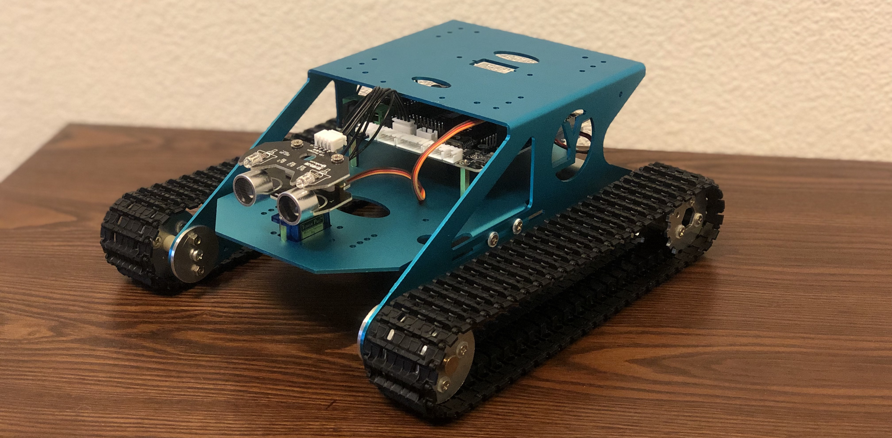

# Arduino Rover

This project contains code for a rover powered by an Arduino Uno to roam around and avoid obstacles using a ultrasonic sensor. 

## Built With

* [Arduino IDE](https://www.arduino.cc/en/Main/Software)

## Prerequisites

You will need the following things properly installed on your computer:

* [Git](http://git-scm.com/)
* [Arduino IDE](https://www.arduino.cc/en/Main/Software)

## Installation

* run `git clone https://github.com/caseyr003/arduino-rover.git`

## Setup

First you will need to build an Arduino powered rover equiped with an ultrasonic sensor and a RGB light (optional)
* I bought a kit that included everything I needed to build the rover
* Above is an image of my completed rover

## Running

Running code on the rover
* Open the Arduino IDE to the auto_drive.ino file
* Update the project based on your specifications
* Connect the cable to your Arduino rover
* Make sure the port and board are correctly set
* Press upload

Your rover will continously move forward right away unless there is an obstacle in the way